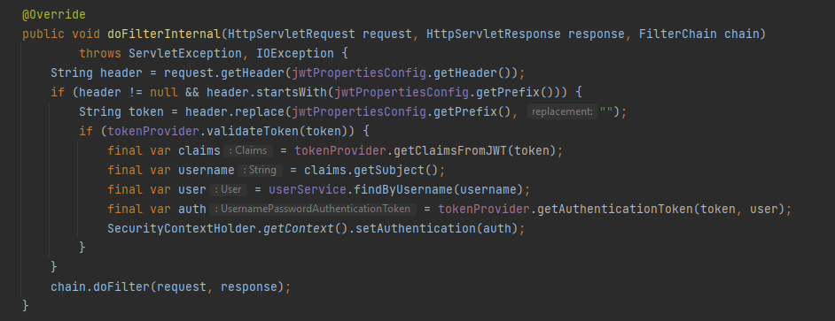
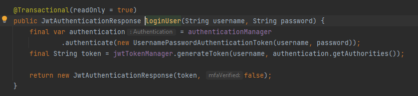
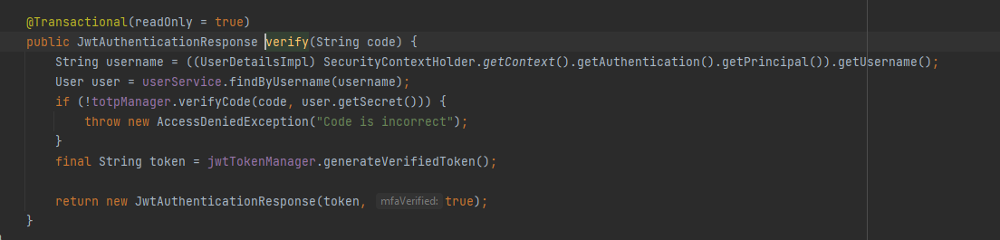
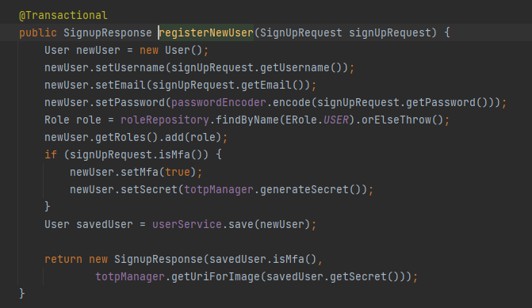
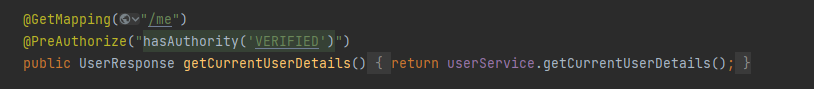

# Topic: Web Authentication & Authorisation.

### Course: Cryptography & Security

### Author: Moisei Liviu

---

## Overview

Authentication & authorization are 2 of the main security goals of IT systems and should not be used interchangibly. Simply put, during authentication the system verifies the identity of a user or service, and during authorization the system checks the access rights, optionally based on a given user role.

There are multiple types of authentication based on the implementation mechanism or the data provided by the user. Some usual ones would be the following:
- Based on credentials (Username/Password); 
- Multi-Factor Authentication (2FA, MFA); 
- Based on digital certificates; 
- Based on biometrics; 
- Based on tokens.

Regarding authorization, the most popular mechanisms are the following:
- Role Based Access Control (RBAC): Base on the role of a user; 
- Attribute Based Access Control (ABAC): Based on a characteristic/attribute of a user.

##  Objectives:

  1. Take what you have at the moment from previous laboratory works and put it in a web service / serveral web services.
  2. Your services should have implemented basic authentication and MFA (the authentication factors of your choice).
  3. Your web app needs to simulate user authorization and the way you authorise user is also a choice that needs to be done by you.
  4. As services that your application could provide, you could use the classical ciphers. Basically the user would like to get access and use the classical ciphers, but they need to authenticate and be authorized.

## Implementation description:

The web server is developed with the use of Spring framework, we use Spring Security module for authentication/authorization functionalities. 
Spring Security architecture is based on the chain of responsibility pattern, there is a chain of filters that are processed before each request. Any of the filters can authorize the user to proceed with the request if 
some condition is fulfilled. In our case, we add a custom filter called 'JwtTokenAuthenticationFilter'. This filter takes the JWT token we provide inside the 'Authorization' header, extracts the username of the issuing user 
and also the roles that are granted to this user.

All the info needed to perform role based access control is contained by the object Authentication. We extract all this info from the token in the header, and then store the Authentication object inside the SecurityContextHolder for later use.
To authenticate, the user uses the endpoint /auth/signin and passes his username and password inside the request body. After we validate these credentials we return the token which contains the user roles, but doesn't contain the role 'Verified'. 

In order to obtain the 'VERIFIED' role, the user needs to pass MFA. For this purpose he can use the /auth/verify/{code} endpoint where he passes the code from the authenticator app.

This code depends on the secret we generate for the user at registration and on the current UTC time. The expiration time for the code is 30 seconds.

After registration we return the Base64 encoded version of a QR code that can be scanned through a authenticator app to fetch the codes at any time.

Lastly, to actually verify if the user has the necessary roles, and if he went through all the authentication processes, we use the @PreAuthorize("hasAuthority()") annotation. This will use the aspect oriented side of Spring to create a proxy object
around controller class and add all the authorization logic and role verification before the method executes.